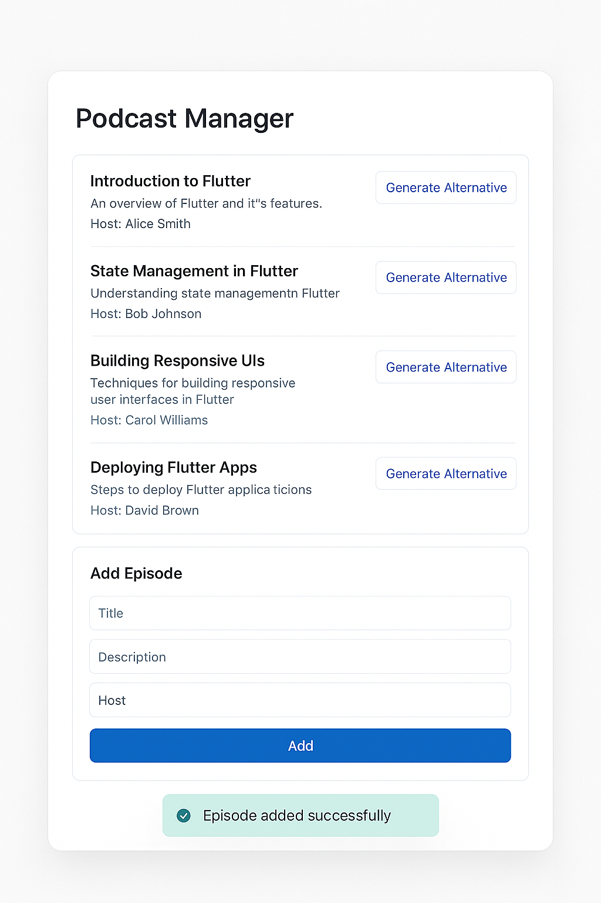

# Flutter Podcast Manager
     



## Install

```bash
# clone repository
git clone --recursive https://github.com/KsArt-IT/FlutterPodcastManager-Flutter
cd FlutterPodcastManager-Flutter
# add keys
chmod +x gen_key.sh
./gen_key.sh
vim .env
# run app
flutter pub get
flutter run -d chrome
```

## Update git-submodule

```bash
git submodule update --init --recursive
```

## CURL Mock Api

### GET

```bash
curl "https://684806bfec44b9f3493f5752.mockapi.io/api/v1/episodes?page=1&limit=5"
```

### POST

```bash
curl -X POST https://684806bfec44b9f3493f5752.mockapi.io/api/v1/episodes \
  -H "Content-Type: application/json" \
  -d '{
    "title": "My First Episode",
    "description": "An intro to the show",
    "host": "John Doe"
  }'
```

## Create LLM Api key
Create file .env and add a line to it with
HUGGINGFACE_API_KEY=your_api_key from <https://huggingface.co/>

## Architecture

- [Clean-Architecture](https://blog.cleancoder.com/uncle-bob/2012/08/13/the-clean-architecture.html)

- [BLoC](https://pub.dev/packages/flutter_bloc)
BLoC (Business Logic Component) is a pattern for separating UI from business logic using streams. It enables reactive state management, improves testability, and keeps the app architecture scalable and maintainable — making it ideal for complex Flutter apps.

- [DI](https://pub.dev/packages/flutter_bloc#blocprovider)
Dependency Injection:
Uses RepositoryProvider for dependency injection (repositories) and BlocProvider for passing BLoCs.
BLoC gets dependencies via context.read<T>().
This simplifies dependency management and makes code testable and scalable.

## API

- [Mock API](https://mockapi.io) for episodes
- [LLM API](https://huggingface.co/) for generate text episodes

## License

MIT license. See the [LICENSE](https://github.com/KsArt-IT/FlutterPodcastManager-Flutter?tab=MIT-1-ov-file) file for details.
